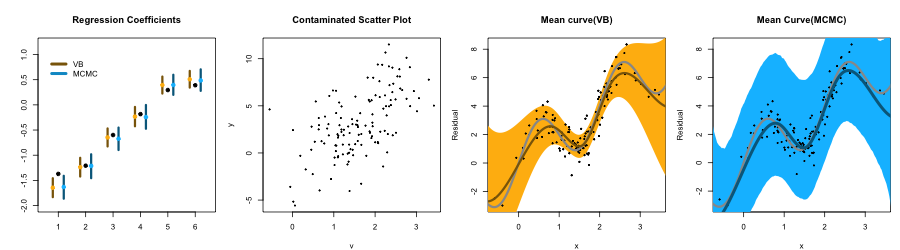

# Semiparametric Regression for Data with Measurement Error

설명변수 x가 반응변수 y와 y = Wb + f(x) + e와 같은 관계를 갖는다고 하겠습니다. W는 input feature들의 matrix, f는 x와 y 사이의 함수적 관계, e는 랜덤 노이즈를 나타냅니다. 여기에 측정오차(Measurement Error)가 포함되었다는 것은 실제 관측된 데이터가 x가 아닌 v = x + e'라는 의미입니다(e'는 e와 독립인 랜덤 노이즈입니다). 예를 들어, 측정 기계가 고장 등의 이유로 정밀하지 않은 측정을 했을 때나 자료를 저장하는 과정에서 반올림을 했을 때 데이터의 참값인 x대신에 측정오차가 포함된 v를 관측하게 됩니다.

이때 v와 y간 관계의 형태를 통해서 f를 파악할 수 없으므로 f의 형태에 대한 어떤 가정도 하지 않는 비모수적 추정이 적합합니다. 또한, f를 추정하는 과정에서 v의 정보를 활용해 x의 참값을 함께 추정합니다.

보다 구체적인 설명을 위해 MCMC를 위한 Stan코드와 VB알고리즘을 구현한 R코드를 작성해 시뮬레이션을 준비했습니다. 제가 연구하고 있는 방법론인 VB의 성능을 MCMC의 성능과 비교해서 보여드리기 위해 각 방법론을 통해 추정한 결과를 함께 포함시켰습니다. f(x)=2x+2sin(πx)로 설정하고, y = Wb + f(x) + e라는 data generating process에 의해 y를 생성했습니다. 왼쪽부터 순서대로 1, 2, 3, 4번 플랏이라고 하겠습니다.

1번 플랏은 회귀 계수 b에 대한 추정 결과입니다. 검은색 점은 b의 참값을 나타냅니다. 노란색, 파란색은 각각 VB, MCMC의 추정 결과를 의미하는데, 점은 b의 추정치, 선은 모수에 대한 95% 신용구간을 나타냅니다(신용구간은 빈도주의의 신뢰구간과 대응되는 개념으로, 모수가 특정 확률로 포함될 구간을 의미합니다).

2번 플랏에는 측정오차가 포함덴 데이터 v와 반응변수 y의 산점도를 담았습니다. 관측된 데이터 v에 포함된, 실제 데이터 x에 대한 측정오차 때문에 사인 패턴은 잘 드러나지 않습니다. `model_vb.R`에 구현한 제 모형은 이런 데이터만 가지고 3번 플랏과 같은 추정결과를 얻는데 사용합니다. 즉, VB기법을 사용해 측정오차로 가려진 실제 패턴을 데이터로부터 찾아내는 데 사용합니다. 회색 선은 실제 f를, 노란색 선은 모형을 통해 추정한 f를 나타냅니다.

3번 플랏을 4번 플랏과 비교했을 때, 두 기법이 유의미한 차이를 보이는 부분은 f에 대한 신용구간 뿐이라는 것을 확인하실 수 있습니다. VB가 MCMC에 비해 신용구간을 좁게 추정하는 결과가 다른 연구에서도 많이 나타났지만, 추정치를 비교했을 때는 큰 차이가 없고 무엇보다 추정 결과를 얻는데 걸리는 시간상 이점이 확실하기 때문에 VB가 최근에 활발하게 연구되고 있습니다. 이 예시에서도 VB, MCMC 각각의 소요시간은 각각 4.973초와 21.558분으로, **VB가 MCMC보다 약 260배 빨랐습니다**.